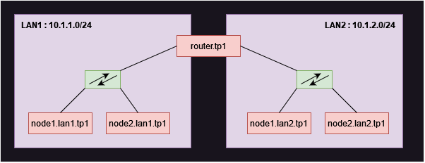

# TP2 : Environnement virtuel

Dans ce TP, on remanipule toujours les mêmes concepts qu'au TP1, mais en environnement virtuel avec une posture un peu plus orientée administrateur qu'au TP1.

- [TP2 : Environnement virtuel](#tp2--environnement-virtuel)
- [0. Prérequis](#0-prérequis)
- [I. Topologie réseau](#i-topologie-réseau)
  - [Topologie](#topologie)
  - [Tableau d'adressage](#tableau-dadressage)
  - [Hints](#hints)
  - [Marche à suivre recommandée](#marche-à-suivre-recommandée)
  - [Compte-rendu](#compte-rendu)
- [II. Interlude accès internet](#ii-interlude-accès-internet)
- [III. Services réseau](#iii-services-réseau)
  - [1. DHCP](#1-dhcp)
  - [2. Web web web](#2-web-web-web)

# 0. Prérequis


La même musique que l'an dernier :

- VirtualBox
- Rocky Linux
  - préparez une VM patron, prête à être clonée
  - système à jour (`dnf update`)
  - SELinux désactivé
  - préinstallez quelques paquets, je pense à notamment à :
    - `vim`
    - `bind-utils` pour la commande `dig`
    - `traceroute`
    - `tcpdump` pour faire des captures réseau

La ptite **checklist** que vous respecterez pour chaque VM :

- [ ] carte réseau host-only avec IP statique
- [ ] pas de carte NAT, sauf si demandée
- [ ] connexion SSH fonctionnelle
- [ ] firewall actif
- [ ] SELinux désactivé
- [ ] hostname défini

Je pardonnerai aucun écart de la checklist côté notation. 🧂🧂🧂

> Pour rappel : une carte host-only dans VirtualBox, ça permet de créer un LAN entre votre PC et une ou plusieurs VMs. La carte NAT de VirtualBox elle, permet de donner internet à une VM.

# I. Topologie réseau

Vous allez dans cette première partie préparer toutes les VMs et vous assurez que leur connectivité réseau fonctionne bien.

On va donc parler essentiellement IP et routage ici.

## Topologie



## Tableau d'adressage

| Node             | LAN1 `10.1.1.0/24` | LAN2 `10.1.2.0/24` |
| ---------------- | ------------------ | ------------------ |
| `node1.lan1.tp2` | `10.1.1.11`        | x                  |
| `node2.lan1.tp2` | `10.1.1.12`        | x                  |
| `node1.lan2.tp2` | x                  | `10.1.2.11`        |
| `node2.lan2.tp2` | x                  | `10.1.2.12`        |
| `router.tp2`     | `10.1.1.254`       | `10.1.2.254`       |

## Hints

➜ **Sur le `router.tp2`**

Il sera nécessaire d'**activer le routage**. Par défaut Rocky n'agit pas comme un routeur. C'est à dire que par défaut il ignore les paquets qu'il reçoit s'il l'IP de destination n'est pas la sienne. Or, c'est précisément le job d'un routeur.

> Dans notre cas, si `node1.lan1.tp2` ping `node1.lan2.tp2`, le paquet a pour IP source `10.1.1.11` et pour IP de destination `10.1.2.11`. Le paquet passe par le routeur. Le routeur reçoit donc un paquet qui a pour destination `10.1.2.11`, une IP qui n'est pas la sienne. S'il agit comme un routeur, il comprend qu'il doit retransmettre le paquet dans l'autre réseau. Par défaut, la plupart de nos OS ignorent ces paquets, car ils ne sont pas des routeurs.

Pour activer le routage donc, sur une machine Rocky :

```bash
$ firewall-cmd --add-masquerade
$ firewall-cmd --add-masquerade --permanent
$ sysctl -w net.ipv4.ip_forward=1
```

---

➜ **Les switches sont les host-only de VirtualBox pour vous**

Vous allez donc avoir besoin de créer deux réseaux host-only. Faites bien attention à connecter vos VMs au bon switch host-only.

---

➜ **Aucune carte NAT**

## Marche à suivre recommandée

Dans l'ordre, je vous recommande de :

**1.** créer les VMs dans VirtualBox (clone du patron)  
**2.** attribuer des IPs statiques à toutes les VMs  
**3.** vous connecter en SSH à toutes les VMs  
**4.** activer le routage sur `router.tp2`  
**5.** vous assurer que les membres de chaque LAN se ping, c'est à dire :

- `node1.lan1.tp2`
  - doit pouvoir ping `node2.lan1.tp2`
  - doit aussi pouvoir ping `router.tp2` (il a deux IPs ce `router.tp2`, `node1.lan1.tp2` ne peut ping que celle qui est dans son réseau : `10.1.1.254`)
- `router.tp2` ping tout le monde
- les membres du LAN2 se ping aussi

**6.** ajouter les routes statiques

- sur les deux machines du LAN1, il faut ajouter une route vers le LAN2
- sur les deux machines du LAN2, il faut ajouter une route vers le LAN1

## Compte-rendu

☀️ Sur **`node1.lan1.tp2`**

- afficher ses cartes réseau
- afficher sa table de routage
- prouvez qu'il peut joindre `node2.lan2.tp2`
- prouvez avec un `traceroute` que le paquet passe bien par `router.tp2`

# II. Interlude accès internet


**On va donner accès internet à tout le monde.** Le routeur aura un accès internet, et permettra à tout le monde d'y accéder : il sera la passerelle par défaut des membres du LAN1 et des membres du LAN2.

**Ajoutez une carte NAT au routeur pour qu'il ait un accès internet.**

☀️ **Sur `router.tp2`**

- prouvez que vous avez un accès internet (ping d'une IP publique)
- prouvez que vous pouvez résoudre des noms publics (ping d'un nom de domaine public)

☀️ **Accès internet LAN1 et LAN2**

- ajoutez une route par défaut sur les deux machines du LAN1
- ajoutez une route par défaut sur les deux machines du LAN2
- configurez l'adresse d'un serveur DNS que vos machines peuvent utiliser pour résoudre des noms
- dans le compte-rendu, mettez-moi que la conf des points précédents sur `node2.lan1.tp2`
- prouvez que `node2.lan1.tp2` a un accès internet :
  - il peut ping une IP publique
  - il peut ping un nom de domaine public

# III. Services réseau

**Adresses IP et routage OK, maintenant, il s'agirait d'en faire quelque chose nan ?**

Dans cette partie, on va **monter quelques services orientés réseau** au sein de la topologie, afin de la rendre un peu utile que diable. Des machines qui se `ping` c'est rigolo mais ça sert à rien, des machines qui font des trucs c'est mieux.

## 1. DHCP


Petite **install d'un serveur DHCP** dans cette partie. Par soucis d'économie de ressources, on recycle une des machines précédentes : `node2.lan1.tp2` devient `dhcp.lan1.tp2`.

**Pour rappel**, un serveur DHCP, on en trouve un dans la plupart des LANs auxquels vous vous êtes connectés. Si quand tu te connectes dans un réseau, tu n'es pas **obligé** de saisir une IP statique à la mano, et que t'as un accès internet wala, alors il y a **forcément** un serveur DHCP dans le réseau qui t'a proposé une IP disponible.

> Le serveur DHCP a aussi pour rôle de donner, en plus d'une IP disponible, deux informations primordiales pour l'accès internet : l'adresse IP de la passerelle du réseau, et l'adresse d'un serveur DNS joignable depuis ce réseau.

**Dans notre TP, son rôle sera de proposer une IP libre à toute machine qui le demande dans le LAN1.**

> Vous pouvez vous référer à [ce lien](https://www.server-world.info/en/note?os=Rocky_Linux_8&p=dhcp&f=1) ou n'importe quel autre truc sur internet (je sais c'est du Rocky 8, m'enfin, la conf de ce serveur DHCP ça bouge pas trop).

---

Pour ce qui est de la configuration du serveur DHCP, quelques précisions :

- vous ferez en sorte qu'il propose des adresses IPs entre `10.1.1.100` et `10.1.1.200`
- vous utiliserez aussi une option DHCP pour indiquer aux clients que la passerelle du réseau est `10.1.1.254` : le routeur
- vous utiliserez aussi une option DHCP pour indiquer aux clients qu'un serveur DNS joignable depuis le réseau c'est `1.1.1.1`

---

☀️ **Sur `dhcp.lan1.tp2`**

- n'oubliez pas de renommer la machine (`node2.lan1.tp2` devient `dhcp.lan1.tp2`)
- changez son adresse IP en `10.1.1.253`
- setup du serveur DHCP
  - commande d'installation du paquet
  - fichier de conf
  - service actif

☀️ **Sur `node1.lan1.tp2`**

- demandez une IP au serveur DHCP
- prouvez que vous avez bien récupéré une IP *via* le DHCP
- prouvez que vous avez bien récupéré l'IP de la passerelle
- prouvez que vous pouvez `ping node1.lan2.tp2`

## 2. Web web web

Un petit serveur web ? Pour la route ?

On recycle ici, toujours dans un soucis d'économie de ressources, la machine `node2.lan2.tp2` qui devient `web.lan2.tp2`. On va y monter un serveur Web qui mettra à disposition un site web tout nul.

---

La conf du serveur web :

- ce sera notre vieil ami NGINX
- il écoutera sur le port 80, port standard pour du trafic HTTP
- la racine web doit se trouver dans `/var/www/site_nul/`
  - vous y créerez un fichier `/var/www/site_nul/index.html` avec le contenu de votre choix
- vous ajouterez dans la conf NGINX **un fichier dédié** pour servir le site web nul qui se trouve dans `/var/www/site_nul/`
  - écoute sur le port 80
  - répond au nom `site_nul.tp2`
  - sert le dossier `/var/www/site_nul/`
- n'oubliez pas d'ouvrir le port dans le firewall 🌼

---

☀️ **Sur `web.lan2.tp2`**

- n'oubliez pas de renommer la machine (`node2.lan2.tp2` devient `web.lan2.tp2`)
- setup du service Web
  - installation de NGINX
  - gestion de la racine web `/var/www/site_nul/`
  - configuration NGINX
  - service actif
  - ouverture du port firewall
- prouvez qu'il y a un programme NGINX qui tourne derrière le port 80 de la machine (commande `ss`)
- prouvez que le firewall est bien configuré

☀️ **Sur `node1.lan1.tp2`**

- éditez le fichier `hosts` pour que `site_nul.tp2` pointe vers l'IP de `web.lan2.tp2`
- visitez le site nul avec une commande `curl` et en utilisant le nom `site_nul.tp2`


